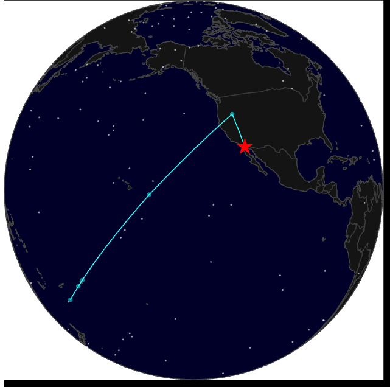
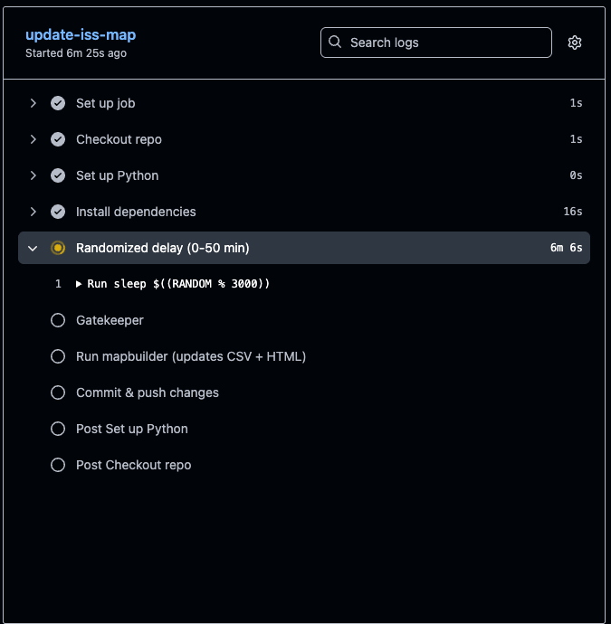

# Personal Map Project  
# 🚀 ISS Map Auto-Updater  

This project automatically fetches the **International Space Station’s live position** several times a day, plots it on an interactive globe (`iss_map.html`), and commits updates back to this repo.  
It uses **GitHub Actions** so it runs in the cloud — no laptop/server needed.  

This is purely for **FUNNNNN** ¯\_(ツ)_/¯ ¯\_(ツ)_/¯ ¯\_(ツ)_/¯  



---

## 🗂 Repository Structure

```
.github/
  workflows/
    iss.yml          # GitHub Actions workflow (runs hourly, 5–20 commits/day)
    gatekeeper.py    # Decides whether to run this hour
mapbuilder.py        # Fetches ISS location, updates CSV + map
iss_positions.csv    # Log of ISS positions over time
iss_map.html         # Interactive globe visualization
```

---

## ⚙️ Workflow (`.github/workflows/iss.yml`)



```yaml
name: ISS Map Auto-Updater

permissions:
  contents: write

on:
  push:
    branches: [ main ]
  schedule:
    - cron: "0 * * * *"   # every hour UTC
  workflow_dispatch:

jobs:
  update-iss-map:
    runs-on: ubuntu-latest

    steps:
    - name: "Checkout repo"
      uses: actions/checkout@v4

    - name: "Set up Python"
      uses: actions/setup-python@v5
      with:
        python-version: "3.11"

    - name: "Install dependencies"
      run: pip install plotly requests pandas

    - name: "Randomized delay (0-50 min)"
      run: |
        DELAY=$((RANDOM % 3000))
        echo "Sleeping for $DELAY seconds (~$((DELAY/60)) minutes)"
        sleep $DELAY

    - name: "Gatekeeper"
      id: gate
      run: python .github/workflows/gatekeeper.py

    - name: "Run mapbuilder (updates CSV + HTML)"
      if: ${{ steps.gate.outputs.run == 'true' }}
      run: python mapbuilder.py

    - name: "Commit & push changes"
      if: ${{ steps.gate.outputs.run == 'true' }}
      run: |
        git config user.name "dzweben"
        git config user.email "danny.zweben99@gmail.com"
        git add iss_map.html iss_positions.csv
        git commit -m "auto: update ISS map $(date -u +'%Y-%m-%d %H:%M:%S UTC')" || echo "No changes to commit"
        git push
```

---

## 🧠 Gatekeeper (`.github/workflows/gatekeeper.py`)

```python
import os, random
from datetime import datetime, timezone
import pandas as pd

now = datetime.now(timezone.utc)
today = now.strftime("%Y-%m-%d")

# Deterministic daily target between 5 and 20
random.seed(today)
target = random.randint(5, 20)

count = 0
try:
    df = pd.read_csv("iss_positions.csv")
    if "ts" in df.columns:
        count = sum(str(ts).startswith(today) for ts in df["ts"])
except Exception:
    pass

remaining_hours = 24 - now.hour

if count >= target:
    decision = False
    reason = f"already reached target {target} (count={count})"
else:
    remaining_needed = max(0, target - count)
    p = min(1.0, max(0.15, remaining_needed / max(1, remaining_hours)))
    decision = random.random() < p
    reason = f"count={count}, target={target}, remaining_hours={remaining_hours}, p={p:.2f}"

print(f"Decision={decision} ({reason})")

# Write output for GitHub Actions
with open(os.environ["GITHUB_OUTPUT"], "a") as fh:
    fh.write(f"run={'true' if decision else 'false'}\n")
```

---

## 🌍 Mapbuilder (`mapbuilder.py`)

This script calls the ISS API, appends the latest position to `iss_positions.csv`, and regenerates `iss_map.html` (interactive globe).  
[Your existing implementation goes here.]

---

✅ Once this is committed, GitHub Actions will:
- Run hourly with random delay  
- Gatekeeper ensures **5–20 updates per day**  
- `mapbuilder.py` fetches & updates  
- Auto-commits results back to repo  
- You get a glowing contribution graph + live ISS map
